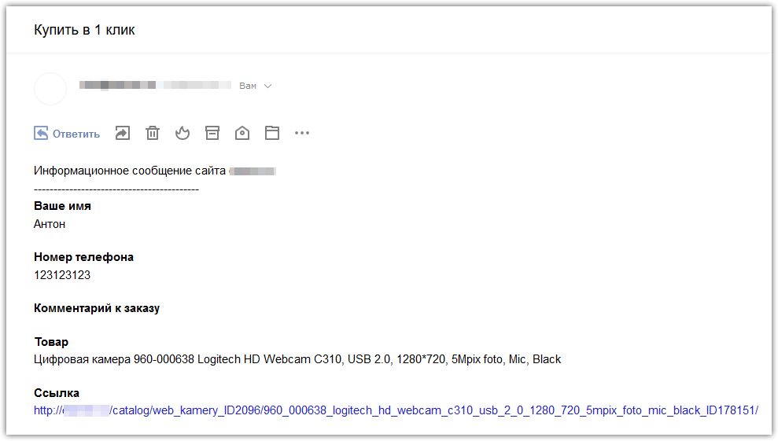

# api.feedback

## TS Умная форма обратной связи (api.feedback)

   TS Умная форма обратной связи предназначена для отправки e-mail сообщений с сайта, записи данных в инфоблок, прикреплять файлы вложениями, поддерживает множество полей и настроек, дополнительные jQuery-плагины  и мн.др.
   
*   В комплекте два адаптивных шаблона, один шаблон - обычный, второй - модальное окно CSS Modal 1, Uikit 2, Bootstrap 3;
*   В комплекте две темы, одна в стиле форм css-фреймворка Uikit;
*   Возможность перенаправлять пользователя на заданную страницу/каталог при успешной отправке формы;
*   Интеграция с целями Яндекс Метрики, т.е. после успешной отправки формы в Я.Метрику будет отправляться цель;
*   Возможность задавать обязательные поля;
*   Возможность включить/отключить автокомплит значений полей формы;
*   Возможность задавать 3 размера полям;
*   Возможность задать стили для кнопки "Отправить";
*   Возможность убрать двоеточие и звездочки в названиях полей;
*   Возможность задать позицию именам полей - слева или над полем;
*   Запись сообщений в инфоблок до срабатывания функции mail();
*   Возможность создать инфоблок и тип инфоблока в параметрах компонента одним кликом;
*   Скрытая CSS-защита от спама, рекомендуется вместо обычной CAPTCHA;
*   Сообщение выводимое пользователю после успешной отправки над формой или в модальном окне;
*   На одной странице может работать хоть сколько форм и каждая работает отдельно при разных ID;
*   Поддержка AJAX Битрикс;
*   Возможность выводить ошибки полей с помощью PHP или jQuery-плагина;
*   Управление филиалами/тикетами (рассылка сообщений по разным e-mail для разных отделов);
*   Возможность задать стили к тени и рамке активного поля отдельно для каждой формы;
*   Возможность задавать маски к полям через data-атрибуты;
*   Возможность задать плейсхолдер отдельно для каждого поля или автоматически всем полям из названия;
*   Возможность задать скрытую копию (BCC) в настройках компонента;
*   Возможность задать ширину модального окна;
*   Возможность группировать поля конструктора;
*   Возможность сортировать поля конструктора;
*   Возможность использовать форму для оформления заказа без регистрации в стиле "Купить в 1 клик";
*   Возможность отправлять в письме Серверные переменные и UTM-метки;
*   Возможность задать флажок с соглашением перед отправкой формы;
*   Возможность каждому полю выводить строковые и html-подсказки;
*   И мн. другое...

